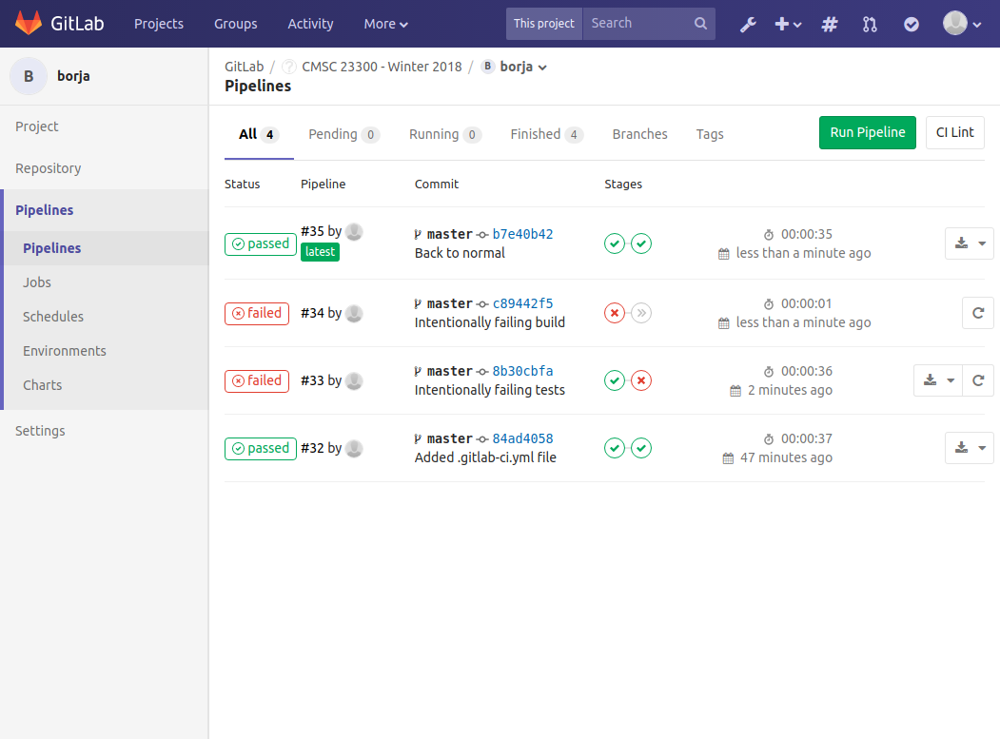
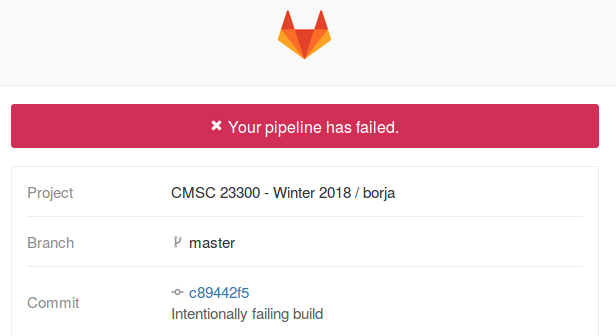
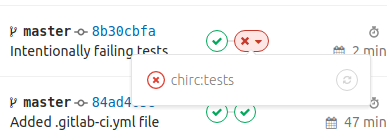
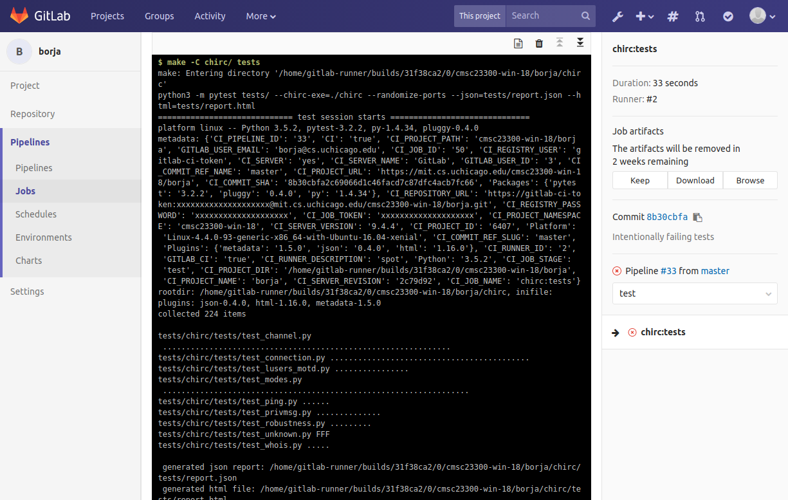

Continuous Integration
----------------------

Any time a software project involves more than one software developer (which is pretty much always), there is the potential for one developer to make changes that could break parts of the code that other developers are working on. Most times, the developer is not aware that they're doing this; they may be focusing on developing and testing only the specific part of the code they were working on, not realizing that their change broke other features in the code (this is often referred to as a *regression*).

To address this problem, a common practice is to perform *continuous integration* (CI): have all developers work on a shared codebase, and have every change to the codebase trigger the running of an extensive set of test cases that cover as much of the code as possible. These tests typically include *unit tests*, which test whether individual components of the project work correctly, as well as *integration tests*, which test whether those individual components work correctly *together*.

For example, the tests you are provided for chirc are all actually integration tests: while they may seem to tests very specific aspects of the project, they all rely on several components of the project working correctly (if you dig into the test code, you'll see that they don't call any of your C functions directly; instead, they launch your chirc executable and communicate with it via a TCP connection). An example of a unit test would be a test that called your IRC message parsing function directly and tested whether it correctly accounted for a number of cases (no parameters, multiple parameters, incorrect commands, etc.)

The GitLab server we use in this class has a built-in Continuous Integration server, which means it is possible to automatically build your code and run the tests every time you push your code (and accessing the results through the GitLab web interface). This has many advantages:

- It immediately alerts you to any issues (typically unintended) in your code. Maybe you pushed code that had unresolved Git merge conflicts, or you made a small change that you thought couldn't possibly break anything (but it did), etc.

- You could have forgotten to add some files to your Git repository. So, it may build correctly on your computer, but not when the code is pulled from scratch from your repository (which is what the graders will do)

- It creates a record of the build/test status of your code. If you need to prove to the instructors that your code was building and/or producing a specific test score, all you need to do is point them to the results of a CI build.

Using GitLab CI
---------------

Enabling CI for your repository just requires adding a configuration file called ``.gitlab-ci.yml`` to the root of your repository. We provide ready-to-use files in our course repository: https://github.com/uchicago-cs/cmsc23300/tree/master/ci Please note that you must take the file for the project you're working on, rename it to ``.gitlab-ci.yml``, add it to the root of your Git repository (not inside your ``chirc``, ``chitcp``, or ``chirouter`` directories), and then commit and push it. After that point, every time you push to your ``master`` branch, it will trigger a build of your code and will run all the tests for that project.

In GitLab CI, the process of building and testing your code after a push is referred to as a *pipeline*. You can see the pipelines that have been run for your repository by logging into the GitLab server (https://mit.cs.uchicago.edu/), going to your repository, and clicking on the Pipelines link on the left:

The above image shows four pipelines: the first (at the bottom) was run with the reference implementation of chirc, so it built correctly and passed all the tests. The next two intentionally cause failures in either the tests or the build, and the fourth one (at the top) fixes those failures. Additionally, you will get an e-mail notification every time a pipeline fails:

On the web interface, you can can also click on individual stages of the pipeline to access the exact output produced by that stage. this can be useful when trying to determine why a build or a test failed:

In this case, clicking on "chirc:tests" will lead to another page with the output of that stage:

 
Frequently Asked Questions
--------------------------

**Can I write my own .gitlab-ci.yml files?**

You are welcome to do so (GitLab CI has a lot of bells and whistles, which you can read about here: https://docs.gitlab.com/ee/ci/) However, the ``.gitlab-ci.yml`` files we provide produce "artifacts" (files that are stored in case they need to be further inspected) that we rely on for some things. If you write your own files, please make sure you continue to produce the same artifacts as our files.

**Can I run only a subset of the tests? I'm not going to pass all the tests until I'm done with the project, and I don't want to get so many failed test notifications!**

The point of doing Continuous Integration is to always run an exhaustive set of tests. Instead of addressing this problem by thinking about how to run fewer tests, you may want to consider doing most of your work on a separate "development" branch of your repository, and only merging to master when you've completed a substantial amount of work. You will still get failed test notifications if you're not passing all of your tests, but if you just pushed a version that passes "all the tests for features X and Y, but not Z", this allows you to double-check that this is still the case.

In general, the ``master`` branch should only contain code that builds and passes all the tests (although, in this class, it is also ok for ``master`` to contain code that passes *some* of the tests). Most of the active development should happen on other branches, merging to ``master`` only when you have completed specific features. If you are unfamiliar with how to use Git branches, we recommend taking a look at `A successful Git branching model <http://nvie.com/posts/a-successful-git-branching-model/>`_.

